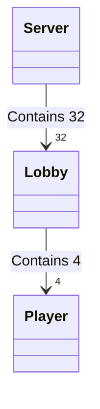

# SH13 Online

> This markdown file uses mermaid for class diagrams and js-sequence for sequence diagrams

### Server side architecture

A server contains 32 precreated Lobby structs. Each Lobby can have 4 pointers to Player structs.



When a client connects to the server :
1. Server looks for an available lobby (i.e. has less than 4 players, and game not finished)
2. A new player struct is created dynamically and added to the lobby
3. A detached thread is created to wait for player messages
4. Server goes back to listen for connection

When 4 players are in a lobby:
1. A detached thread is created for the lobby
3. Server goes back to listen for connection

Thanks to multithreading, the server can handle 32 totally independent lobbies.

Player threads wait for messages from their clients, and communicate with their Lobby thread via cond signals.

Lobby thread will then send the correct response to its 4 clients (broadcast) or to just one client.


### In Game communication


```sequence
participant Client1
participant Client2
participant Server
participant Client3
participant Client4

Title : Sequence diagram of client-server communication of "SH13-Online"

Client1->Server: ""Bob""
Server-->Client1: ""ack""
Server->Client1: ""W1""

Client2->Server: ""Lea""
Server-->Client2: ""ack""
Server->Client2: ""W2""

Client3->Server: ""Alex""
Server-->Client3: ""ack""
Server->Client3: ""W3""

Client4->Server: ""Alice""
Server-->Client4: ""ack""
Server->Client4: ""W4""

Note over Server: Lobby is full, create a \nnew thread for lobby\nand broadcast \ngamestart message 
Server->Client1: ""S3Bob3Lea4Alex5Alice""
Client1-->Server: ""ack""
Server->Client2: ""S3Bob3Lea4Alex5Alice""
Client2-->Server: ""ack""
Note left of Client1: Clients always respond\n with "ack" when they receive\n a message from server 
Server->Client3: ""S3Bob3Lea4Alex5Alice""
Client3-->Server: ""ack""
Server->Client4: ""S3Bob3Lea4Alex5Alice""
Client4-->Server: ""ack""

Note over Server: Shuffle cards and \ndistribute them \n(cards numbers are not in ASCII)
Server->Client1: "C"+0x06020c00
Client1-->Server: ""ack""
Server->Client2: "C"+0x0b010800
Client2-->Server: ""ack""
Server->Client3: "C"+0x04050900
Client3-->Server: ""ack""
Server->Client4: "C"+0x070d0a00
Client4-->Server: ""ack""

Note over Client1, Client4: -\nGame takes place\n-

```

