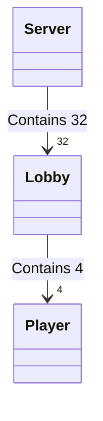

# SH13 Online

> This markdown file uses mermaid for class diagrams and js-sequence for sequence diagrams

### Build and run

The makefile is provided. Run make at project root. Programs will be created in bin folder.

For server : `./server.exe <port> [-d|--debug]`

For client : `./client.exe <host> <port> [-d|-debug]`

Debug option will run the programs with a (*very*, at least for the server) verbose output.

### Server architecture

On launch, the server creates 32 Lobby structs and a thread for each one.

Each Lobby has 4 pointers to Player structs.



When a client connects to the server :
1. Server looks for an available lobby
2. A new player struct is created dynamically and added to the lobby
3. A detached thread is created to wait for player messages
4. Server goes back to listen for connections

When 4 players are in a lobby, the last player to join will notify the lobby thread and the game will start.


Thanks to multi-threading, the server can handle 32 totally independent lobbies.

Player threads wait for messages from their clients, and communicate with their Lobby thread via cond signals.

Lobby thread will then send the correct response to its 4 clients (broadcast) or to just one client.


### In Game communication

```sequence
participant Client1
participant Client2
participant Server
participant Client3
participant Client4

Title : Sequence diagram of client-server communication of "SH13-Online"

Client1->Server: ""Bob""
Server-->Client1: ""ack""
Server->Client1: ""W1""

Client2->Server: ""Lea""
Server-->Client2: ""ack""
Server->Client2: ""W2""

Client3->Server: ""Alex""
Server-->Client3: ""ack""
Server->Client3: ""W3""

Client4->Server: ""Alice""
Server-->Client4: ""ack""
Server->Client4: ""W4""

Note over Server: Lobby is full, start game 
Server->Client1: ""S3Bob3Lea4Alex5Alice""
Client1-->Server: ""ack""
Server->Client2: ""S3Bob3Lea4Alex5Alice""
Client2-->Server: ""ack""
Note left of Client1: Clients always respond\n with "ack" when they receive\n a message from server 
Server->Client3: ""S3Bob3Lea4Alex5Alice""
Client3-->Server: ""ack""
Server->Client4: ""S3Bob3Lea4Alex5Alice""
Client4-->Server: ""ack""

Note over Server: Shuffle cards and \ndistribute them \n(cards numbers are not in ASCII)
Server->Client1: "C"+0x06020c00
Client1-->Server: ""ack""
Server->Client2: "C"+0x0b010800
Client2-->Server: ""ack""
Server->Client3: "C"+0x04050900
Client3-->Server: ""ack""
Server->Client4: "C"+0x070d0a00
Client4-->Server: ""ack""

Note over Client1, Client4: -\nGame takes place\n-

```

The game uses a simple text protocol with 13 different commands : 

| Command name | Emitter | Receiver | Syntax | Description |
| ------------ | ------- | ------ | ----------- | ------------ |
|`WaitingPlayers`| Server | All clients | "W\<X>" | X : the number of players waiting in lobby |
|`GameStart`| Server | All clients | "S\<L1N1L2N2L3N3L4N4>" | Ni : name of player i<br />Li : length of player i name |
|`DistribCards`| Server | One client | "C\<B>" | B : 3 bytes containing the index of a player's cards |
|`PlayerTurn`| Server | All clients | "T\<X>" | X : index of the player who will play next |
|`AskItem`| Client | Server | "I\<PT>" | P : index of the player emitting the message<br />T : index of the item they are asking for |
|`AnswerItem`| Server | All clients | "J\<TR1R2R3R4>" | T : index of the item<br />Ri : answer for player i, can be either '0', '*' or '?' |
|`AskPlayer`| Client | Server | "P\<ICT>" | I : index of the player emitting the message<br />C : index of the targeted player<br />T : index of the item |
|`AnswerPlayer`| Server | All clients | "O\<PTC>" | P : index of the player<br />T : index of the item<br />C : number of items T player P has |
|`GuessSuspect`| Client | Server | "G\<PB>" | P : index of the player emitting the message<br />B : a byte containing the index of the character guess (1 to 13) |
| `AnswerSuspect` | Server | All clients | "H\<RB>" | R : '0' when the guess is incorrect, '1' when the guess is correct<br />B : a byte containing the index of the character guess (1 to 13) |
| `Victory` | Server | All clients | "V\<P>" | P : index of the player who won |
| `Replay` | Client | Server | "R" | Tells the server to queue for a new game in the same lobby |
| `QuitLobby` | Server | One client | "Q" | Tells a client to leave the lobby |


### Possible improvements

- Use a thread pool for players. Every time a new player connects, assign a worker to them. When the player closes the connection, the worker is released and put back into the pool.
- Use a queue to store available lobbies, this way when a client connects the server can just get the front lobby in the queue and add the player. If the Lobby has 4 players, pop the first element of the queue. When a lobby finished its game, append the lobby to the queue.
- Use a circular list to store players pointers in the lobby instead of an array. This way the turn field can be a pointer to player pointer. When it is next turn, the turn pointer would point to the next element of the list .